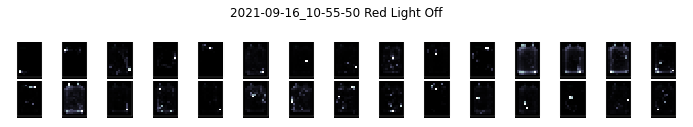
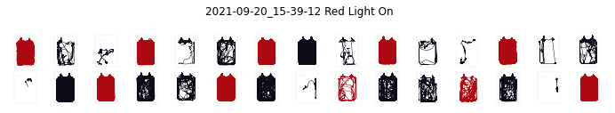
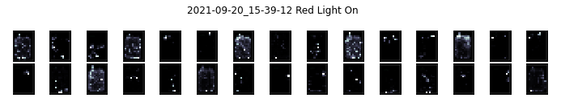
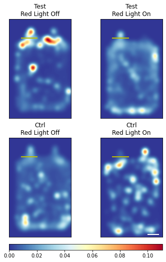
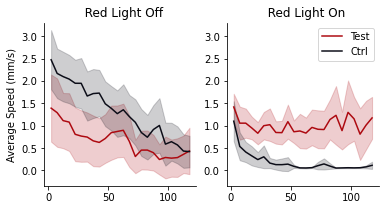
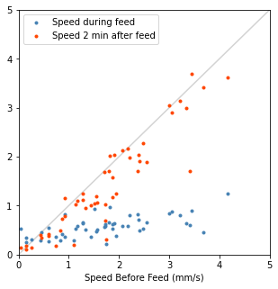
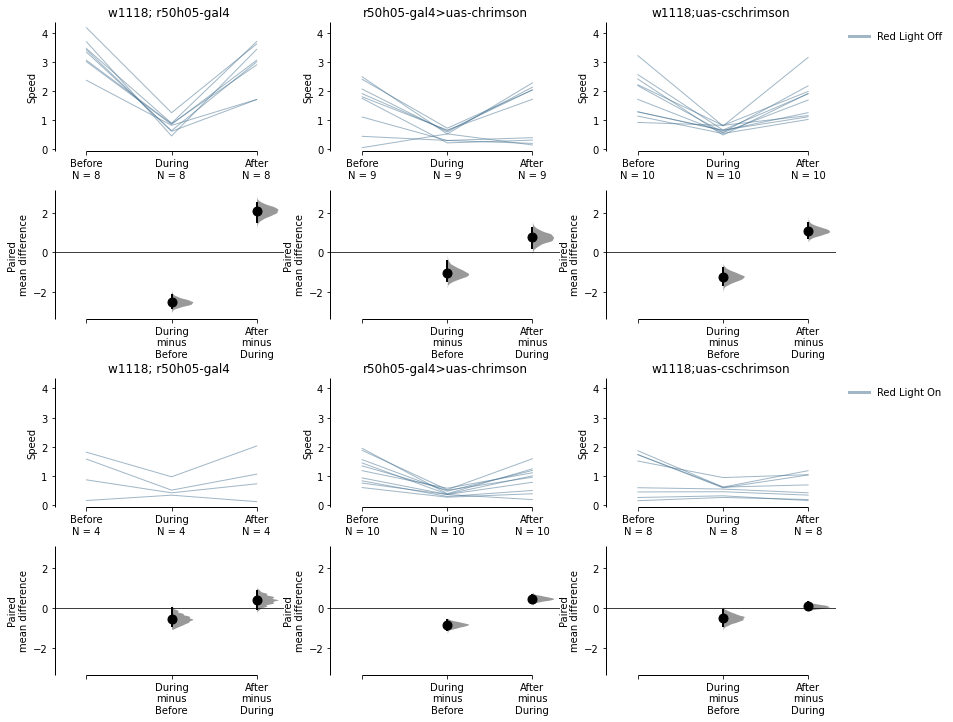

esploco
================

<!-- WARNING: THIS FILE WAS AUTOGENERATED! DO NOT EDIT! -->

This is a package that would analyse your countlogs from espresso

## Install

``` sh
pip install esploco
```

## this code is a bit slow. it’s in the process of being refactored

## How to use

Download a demo dataset from
https://drive.google.com/drive/folders/1v-0Y_xNaec4OhzOqzwE8L2Wng8Cn-\_vq?usp=share_link

``` python
esplocoPath='D:\\xusy\\demo'
el = esploco.esploco(esplocoPath, 0, 120)

#
#or if you also have espresso imported 
# e = espresso(esplocoPath, expt_duration_minutes=120)
# ele = esploco.esploco(esplocoPath, 0, 120, companionEspObj = e)
```

    countLog files found: 

    ['CountLog_2021-09-16_10-55-50.csv' 'CountLog_2021-09-20_15-39-12.csv']

    metaData files found: 

    ['MetaData_2021-09-16_10-55-50.csv' 'MetaData_2021-09-16_10-55-52.csv'
     'MetaData_2021-09-20_15-39-12.csv' 'MetaData_2021-09-20_15-39-14.csv']
    portLocations files found: 

    ['PortLocations_2021-09-16_10-55-52.csv'
     'PortLocations_2021-09-20_15-39-14.csv']

    feedLog files found: 

    ['FeedLog_2021-09-16_10-55-52.csv' 'FeedLog_2021-09-20_15-39-14.csv']
    CountLog_2021-09-16_10-55-50.csv
    MetaData_2021-09-16_10-55-50.csv
    CountLog_2021-09-20_15-39-12.csv
    MetaData_2021-09-20_15-39-12.csv

## you can plot some small multiples

``` python
el.plotChamberSmallMultiples()
# ele.plotChamberSmallMultiples()
```

    Espresso Runs found:

    ['2021-09-16_10-55-50' '2021-09-20_15-39-12']


     plotting 2021-09-16_10-55-50...


     plotting 2021-09-20_15-39-12...

    (array([<Figure size 720x144 with 30 Axes>,
            <Figure size 720x144 with 30 Axes>], dtype=object),
     array([<Figure size 720x144 with 30 Axes>,
            <Figure size 720x144 with 30 Axes>], dtype=object))








## you can plot some heat maps

``` python
el.plotMeanHeatMaps(row = 'Status', col = 'Temperature')
# ele.plotMeanHeatMaps(row = 'Status', col = 'Temperature')
```

    <Figure size 360x748.8 with 0 Axes>



## you can plot some ribbons

``` python
el.plotBoundedLines(col = 'Temperature', colorBy = 'Status')
# ele.plotBoundedLines(col = 'Temperature', colorBy = 'Status')
```

    (<Figure size 432x216 with 2 Axes>,
     array([[<AxesSubplot:title={'center':'  Red Light Off'}, ylabel='Average Speed (mm/s)'>,
             <AxesSubplot:title={'center':'  Red Light On'}>]], dtype=object),
     [<matplotlib.lines.Line2D>,
      <matplotlib.lines.Line2D>,
      <matplotlib.lines.Line2D>,
      <matplotlib.lines.Line2D>],
     [<matplotlib.collections.PolyCollection>,
      <matplotlib.collections.PolyCollection>,
      <matplotlib.collections.PolyCollection>,
      <matplotlib.collections.PolyCollection>])



## if you have companion an espresso object you can also calculate this

``` python
# ele.calculatePeriFeedSpeed(e, monitorWindow=120)
```

    recalculating feed duration for feeds...

    [------------------------------------------------------------------------------------------------------------------------------------------------------------------------------------------------------------------------------------------------------------------------------------------------------------------------------------------------------------------------------------------------------------------------------------------------------------------------------------------------------------------------------------------------------------------------------------------------------------------------------------------]
    putting feeds back into countlog...

    [------------------------------------------------------------------------------------------------------------------------------------------------------------------------------------------------------------------------------------------------------------------------------------------------------------------------------------------------------------------------------------------------------------------------------------------------------------------------------------------------------------------------------------------------------------------------------------------------------------------------------------------]
    Index(['ID', 'Status', 'Genotype', 'Sex', 'MinimumAge', 'MaximumAge', 'Food1',
           'Food2', 'Temperature', '#Flies', 'Starvedhrs', 'Date',
           'averageSpeed_mm/s', 'xPosition_mm', 'yPosition_mm', 'inLeftPort',
           'inRightPort', 'countLogDate', 'feedLogDate', 'ChamberID'],
          dtype='object')
    Index(['ChamberID', 'countLogID_Mean', 'FeedDuration_ms_Mean',
           'FeedDuration_s_Mean', 'FeedSpeed_nl/s_Mean', 'FeedVol_nl_Mean',
           'FeedVol_µl_Mean', 'RelativeTime_s_Mean', 'Valid_Mean',
           'Starved hrs_Mean', 'AverageFeedVolumePerFly_µl_Mean',
           'AverageFeedCountPerFly_Mean', 'AverageFeedSpeedPerFly_µl/s_Mean',
           '120beforeFeedSpeed_mm/s_Mean', 'duringFeedSpeed_mm/s_Mean',
           '120afterFeedSpeed_mm/s_Mean', 'revisedFeedDuration_s_Mean',
           '120duringPercSpeedGain_Mean', '120afterPercSpeedGain_Mean',
           'revisedFeedDuration_min_Mean', 'FeedDuration_ms_Total',
           'FeedDuration_s_Total', 'FeedVol_nl_Total', 'FeedVol_µl_Total',
           'Valid_Total', 'AverageFeedVolumePerFly_µl_Total',
           'AverageFeedCountPerFly_Total', 'AverageFeedSpeedPerFly_µl/s_Total',
           'revisedFeedDuration_s_Total', '120duringPercSpeedGain_Total',
           '120afterPercSpeedGain_Total', 'revisedFeedDuration_min_Total',
           'duringBeforeSpeedRatio', 'afterBeforeSpeedRatio'],
          dtype='object')
    plotting PeriFeedDiagonal
    plotting pairedSpeedPlots
    dabest version = 0.3.9999




