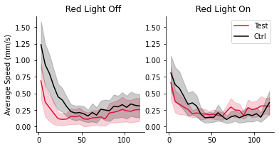

Tutorial
================

<!-- WARNING: THIS FILE WAS AUTOGENERATED! DO NOT EDIT! -->

## Install: change directory to the folder “esploco” and then run

``` sh
pip install esploco
```

## How to use

1.  Download a demo dataset from
    https://drive.google.com/drive/folders/1v-0Y_xNaec4OhzOqzwE8L2Wng8Cn-\_vq?usp=share_link

2.  Import libraries

``` python
# from esploco import esploco
# from espresso import espresso
```

Hint: to see the function signature of any function or method, type
function?

``` python
# esploco.esploco?
```

``` python
# esplocoPath='D:\\xusy\mb113'
# e = espresso(esplocoPath, expt_duration_minutes=120)
# ele = esploco.esploco(esplocoPath, 0, 120, companionEspObj = e)
```

    C:\Users\xusy\.conda\envs\nbdevdabestdev\lib\site-packages\pandas\core\arrays\categorical.py:2631: FutureWarning: The `inplace` parameter in pandas.Categorical.remove_unused_categories is deprecated and will be removed in a future version.
      res = method(*args, **kwargs)

    countLog files found: 

    ['CountLog_2019-07-09_15-19-37.csv' 'CountLog_2020-03-09_11-49-38.csv'
     'CountLog_2020-03-17_14-35-58.csv' 'CountLog_2020-06-26_13-13-58.csv'
     'CountLog_2021-06-25_17-56-21.csv' 'CountLog_2021-07-13_16-18-05.csv'
     'CountLog_2021-07-15_15-12-44.csv' 'CountLog_2021-07-16_15-18-24.csv']

    metaData files found: 

    ['MetaData_2019-07-09_15-19-37.csv' 'MetaData_2019-07-09_15-19-39.csv'
     'MetaData_2020-03-09_11-49-38.csv' 'MetaData_2020-03-09_11-49-41.csv'
     'MetaData_2020-03-17_14-35-58.csv' 'MetaData_2020-03-17_14-36-00.csv'
     'MetaData_2020-06-26_13-13-58.csv' 'MetaData_2020-06-26_13-14-00.csv'
     'MetaData_2021-06-25_17-56-21.csv' 'MetaData_2021-06-25_17-56-24.csv'
     'MetaData_2021-07-13_16-18-05.csv' 'MetaData_2021-07-13_16-18-08.csv'
     'MetaData_2021-07-15_15-12-44.csv' 'MetaData_2021-07-15_15-12-46.csv'
     'MetaData_2021-07-16_15-18-24.csv' 'MetaData_2021-07-16_15-18-26.csv']
    portLocations files found: 

    ['PortLocations_2019-07-09_15-19-39.csv'
     'PortLocations_2020-03-09_11-49-41.csv'
     'PortLocations_2020-03-17_14-36-00.csv'
     'PortLocations_2020-06-26_13-14-00.csv'
     'PortLocations_2021-06-25_17-56-24.csv'
     'PortLocations_2021-07-13_16-18-08.csv'
     'PortLocations_2021-07-15_15-12-46.csv'
     'PortLocations_2021-07-16_15-18-26.csv']

    feedLog files found: 

    ['FeedLog_2019-07-09_15-19-39.csv' 'FeedLog_2020-03-09_11-49-41.csv'
     'FeedLog_2020-03-17_14-36-00.csv' 'FeedLog_2020-06-26_13-14-00.csv'
     'FeedLog_2021-06-25_17-56-24.csv' 'FeedLog_2021-07-13_16-18-08.csv'
     'FeedLog_2021-07-15_15-12-46.csv' 'FeedLog_2021-07-16_15-18-26.csv']
    CountLog_2019-07-09_15-19-37.csv
    MetaData_2019-07-09_15-19-37.csv
    CountLog_2020-03-09_11-49-38.csv
    MetaData_2020-03-09_11-49-38.csv
    CountLog_2020-03-17_14-35-58.csv
    MetaData_2020-03-17_14-35-58.csv
    CountLog_2020-06-26_13-13-58.csv
    MetaData_2020-06-26_13-13-58.csv
    CountLog_2021-06-25_17-56-21.csv
    MetaData_2021-06-25_17-56-21.csv
    CountLog_2021-07-13_16-18-05.csv
    MetaData_2021-07-13_16-18-05.csv
    MetaData is missing IDs [16 26]
    CountLog_2021-07-15_15-12-44.csv
    MetaData_2021-07-15_15-12-44.csv
    MetaData is missing IDs [22 27]
    CountLog_2021-07-16_15-18-24.csv
    MetaData_2021-07-16_15-18-24.csv

## Calculate peri-feed speeds

``` python
# ele.calculatePeriFeedSpeed(e, monitorWindow=120)
```

    recalculating feed duration for feeds...

    [----------------------------------------------------------------------------------------------------------------------------------------------------------------------------------------------------------------------------------------------------------------------------------------------------------------------------------------------------------------------------------------------------------------------------------------------------------------------------------------------------------------------------------------------------------------------------------------------------------------------------------------------------------------------------------------------------------------------------------------------------------------------------------------------------------------------------------------------------------------------------------------------------------------------------------------------------------------------------------------------------------------------------------------------------------------------------------------------------------------------------------------------------------------------------------------------------------------------------------------------------------------------------------------------------------------------------------------------------------------------------------------------------------------------------------------------------------------------------------------------------------------------------------------------------------------------------------------------------------------------------------------------------------------------------------------------------------------------------------------------------------------------------------------------------------------------------------------------------------------------------------------------------------------------------------------------------------------------------------------------------------------------------------------------------------------------------------------------------------------------------------------------------------------------------------------------------------------------------------------------------------------------------------------------------------------------------------------------------------------------------------------------------------------------------------------------------------------------------------------------------------------------------------------------------------------------------------------------------------------------------------------------------------------------------------------------------------------------------------------------------------------------------------------------------------------------------------------------------------------------------------------------------------------------------------------------------------------------------------]

    C:\Users\xusy\.conda\envs\nbdevdabestdev\lib\site-packages\esploco\esploco.py:361: FutureWarning: Dropping invalid columns in DataFrameGroupBy.mean is deprecated. In a future version, a TypeError will be raised. Before calling .mean, select only columns which should be valid for the function.
      self.feedsRevisedDf, self.countLogDf, self.meanPeriSpeed, self.maxSpeed= locoDataMunger.calculatePeriFeedLoco(
    C:\Users\xusy\.conda\envs\nbdevdabestdev\lib\site-packages\esploco\locoDataMunger.py:361: FutureWarning: Dropping invalid columns in DataFrameGroupBy.add is deprecated. In a future version, a TypeError will be raised. Before calling .add, select only columns which should be valid for the function.
      total_df = grouped_df.sum(numeric_only=False)

    putting feeds back into countlog...

    [----------------------------------------------------------------------------------------------------------------------------------------------------------------------------------------------------------------------------------------------------------------------------------------------------------------------------------------------------------------------------------------------------------------------------------------------------------------------------------------------------------------------------------------------------------------------------------------------------------------------------------------------------------------------------------------------------------------------------------------------------------------------------------------------------------------------------------------------------------------------------------------------------------------------------------------------------------------------------------------------------------------------------------------------------------------------------------------------------------------------------------------------------------------------------------------------------------------------------------------------------------------------------------------------------------------------------------------------------------------------------------------------------------------------------------------------------------------------------------------------------------------------------------------------------------------------------------------------------------------------------------------------------------------------------------------------------------------------------------------------------------------------------------------------------------------------------------------------------------------------------------------------------------------------------------------------------------------------------------------------------------------------------------------------------------------------------------------------------------------------------------------------------------------------------------------------------------------------------------------------------------------------------------------------------------------------------------------------------------------------------------------------------------------------------------------------------------------------------------------------------------------------------------------------------------------------------------------------------------------------------------------------------------------------------------------------------------------------------------------------------------------------------------------------------------------------------------------------------------------------------------------------------------------------------------------------------------------------------------]
    plotting PeriFeedDiagonal
    plotting pairedSpeedPlots
    dabest version = 0.3.9999

    C:\Users\xusy\.conda\envs\nbdevdabestdev\lib\site-packages\dabest\_classes.py:1855: UserWarning: The lower limit of the interval was in the bottom 10 values. The result should be considered unstable.
      warnings.warn(err_temp.substitute(lim_type="lower",


## Calculate falls

``` python
# ele.calculateFallEvents()
```

    Detecting Fall Events...

    [--------------------------------------------------------------------------------------------------------------------------------------------------------------------------------------------------------------------------------------------]
    Done

``` python
# ele.resultsDf.columns
```

    Index(['ChamberID', 'Starved hrs', 'MealSizePerFly_µL',
           'AverageFeedSpeedPerFly_µl/s', 'startMonitorIdx', 'startFeedIdx',
           'startFeedIdxRevised', 'endFeedIdx', 'endFeedIdxRevised',
           'endMonitorIdx', 'MeanSpeed120sBeforeFeed_mm/s',
           'MeanSpeedDuringFeed_mm/s', 'MeanSpeed120sAfterFeed_mm/s',
           'MeanMealDurationPerFly_s', 'AviFile', 'ExperimentState', 'Tube1',
           'AverageFeedVolumePerFly_µl', 'AverageFeedCountPerFly',
           'AverageFeedDurationPerFly_min', 'FeedVol_pl', 'Latency_min',
           'duringBeforeSpeedRatio', 'afterBeforeSpeedRatio', 'ID', 'Status',
           'Genotype', 'Sex', 'MinimumAge', 'MaximumAge', 'Food1', 'Food2',
           'Temperature', '#Flies', 'Starvedhrs', 'Date', 'averageSpeed_mm/s',
           'xPosition_mm', 'yPosition_mm', 'inLeftPort', 'inRightPort',
           'countLogDate', 'feedLogDate', 'falls'],
          dtype='object')

## Stacked plot for feeds and other metrics

``` python
# Fstacked, feeds_sorted, colorBy = ele.plotStacked(endMin = 120, 
#                           colorBy = ['Status', 'Temperature'], 
#                           metricsToStack = ['Volume', 'Speed'], 
#                           figsize = None,
#                           plotNonFeeders=False, 
#                           showRasterYticks=True, 
#                          ylimPresets = None)

#consult the function signature for different configurations of input arguments
```

    C:\Users\xusy\.conda\envs\nbdevdabestdev\lib\site-packages\esploco\esploco.py:541: UserWarning: FixedFormatter should only be used together with FixedLocator
      axbig.set_yticklabels(s, fontsize = 5)


## Plotting small multiples

``` python
# ele.plotChamberSmallMultiples()
```

    Espresso Runs found:

    ['2019-07-09_15-19-37' '2020-03-09_11-49-38' '2020-03-17_14-35-58'
     '2020-06-26_13-13-58' '2021-06-25_17-56-21' '2021-07-13_16-18-05'
     '2021-07-15_15-12-44' '2021-07-16_15-18-24']


     plotting 2019-07-09_15-19-37...


     plotting 2020-03-09_11-49-38...


     plotting 2020-03-17_14-35-58...


     plotting 2020-06-26_13-13-58...


     plotting 2021-06-25_17-56-21...


     plotting 2021-07-13_16-18-05...


     plotting 2021-07-15_15-12-44...


     plotting 2021-07-16_15-18-24...

    (array([<Figure size 720x144 with 30 Axes>,
            <Figure size 720x144 with 30 Axes>,
            <Figure size 720x144 with 30 Axes>,
            <Figure size 720x144 with 30 Axes>,
            <Figure size 720x144 with 30 Axes>,
            <Figure size 720x144 with 30 Axes>,
            <Figure size 720x144 with 30 Axes>,
            <Figure size 720x144 with 30 Axes>], dtype=object),
     array([<Figure size 720x144 with 30 Axes>,
            <Figure size 720x144 with 30 Axes>,
            <Figure size 720x144 with 30 Axes>,
            <Figure size 720x144 with 30 Axes>,
            <Figure size 720x144 with 30 Axes>,
            <Figure size 720x144 with 30 Axes>,
            <Figure size 720x144 with 30 Axes>,
            <Figure size 720x144 with 30 Axes>], dtype=object))


## Mean heat maps

``` python
# ele.plotMeanHeatMaps(row = 'Genotype', col = 'Temperature')
```

    <Figure size 360x2764.8 with 0 Axes>


## Ribbon Plots

``` python
# ele.plotBoundedLines(col = 'Temperature', colorBy = 'Status')
```

    (<Figure size 432x216 with 2 Axes>,
     array([[<AxesSubplot:title={'center':'  Red Light Off'}, ylabel='Average Speed (mm/s)'>,
             <AxesSubplot:title={'center':'  Red Light On'}>]], dtype=object),
     [<matplotlib.lines.Line2D>,
      <matplotlib.lines.Line2D>,
      <matplotlib.lines.Line2D>,
      <matplotlib.lines.Line2D>],
     [<matplotlib.collections.PolyCollection>,
      <matplotlib.collections.PolyCollection>,
      <matplotlib.collections.PolyCollection>,
      <matplotlib.collections.PolyCollection>])



## Contrast plots for metrics in .resultsDf

‘ChamberID’, ‘Starved hrs’, ‘MealSizePerFly_µL’,
‘AverageFeedSpeedPerFly_µl/s’, ‘startMonitorIdx’, ‘startFeedIdx’,
‘startFeedIdxRevised’, ‘endFeedIdx’, ‘endFeedIdxRevised’,
‘endMonitorIdx’, ‘MeanSpeed120sBeforeFeed_mm/s’,
‘MeanSpeedDuringFeed_mm/s’, ‘MeanSpeed120sAfterFeed_mm/s’,
‘MeanMealDurationPerFly_s’, ‘AviFile’, ‘ExperimentState’, ‘Tube1’,
‘AverageFeedVolumePerFly_µl’, ‘AverageFeedCountPerFly’,
‘AverageFeedDuration_min’, ‘FeedVol_pl’, ‘Latency_min’,
‘duringBeforeSpeedRatio’, ‘afterBeforeSpeedRatio’, ‘ID’, ‘Status’,
‘Genotype’, ‘Sex’, ‘MinimumAge’, ‘MaximumAge’, ‘Food1’, ‘Food2’,
‘Temperature’, ‘\#Flies’, ‘Starvedhrs’, ‘Date’, ‘averageSpeed_mm/s’,
‘xPosition_mm’, ‘yPosition_mm’, ‘inLeftPort’, ‘inRightPort’,
‘countLogDate’, ‘feedLogDate’

``` python
# import dabest
# print(dabest.__version__)

# contrast = dabest.load(data = ele.resultsDf, 
#                        x = ['Temperature', 'Genotype'], 
#                        y = 'MealSizePerFly_µL', 
#                        experiment = 'Status', x1_level=['Red Light Off', 'Red Light On'] , delta2 = True)
# f = contrast.mean_diff.plot()
# f.axes[0].set_xticklabels(['Ctrl Off', 'Ctrl On', 'Test Off', 'Test On'])
# f.axes[1].set_xticklabels(['', 'Ctrl Δ', '', 'Test Δ', '', 'ΔΔ'])
```

    0.3.9999

    C:\Users\xusy\.conda\envs\nbdevdabestdev\lib\site-packages\seaborn\categorical.py:1296: UserWarning: 22.8% of the points cannot be placed; you may want to decrease the size of the markers or use stripplot.
      warnings.warn(msg, UserWarning)
    C:\Users\xusy\.conda\envs\nbdevdabestdev\lib\site-packages\seaborn\categorical.py:1296: UserWarning: 30.8% of the points cannot be placed; you may want to decrease the size of the markers or use stripplot.
      warnings.warn(msg, UserWarning)

    [Text(0, 0, ''),
     Text(1, 0, 'Ctrl Δ'),
     Text(2, 0, ''),
     Text(3, 0, 'Test Δ'),
     Text(4, 0, ''),
     Text(5, 0, 'ΔΔ')]

    C:\Users\xusy\.conda\envs\nbdevdabestdev\lib\site-packages\IPython\core\pylabtools.py:151: UserWarning: This figure includes Axes that are not compatible with tight_layout, so results might be incorrect.
      fig.canvas.print_figure(bytes_io, **kw)


``` python
# ele.resultsDf.columns
```

    Index(['ChamberID', 'Starved hrs', 'MealSizePerFly_µL',
           'AverageFeedSpeedPerFly_µl/s', 'startMonitorIdx', 'startFeedIdx',
           'startFeedIdxRevised', 'endFeedIdx', 'endFeedIdxRevised',
           'endMonitorIdx', 'MeanSpeed120sBeforeFeed_mm/s',
           'MeanSpeedDuringFeed_mm/s', 'MeanSpeed120sAfterFeed_mm/s',
           'MeanMealDurationPerFly_s', 'AviFile', 'ExperimentState', 'Tube1',
           'AverageFeedVolumePerFly_µl', 'AverageFeedCountPerFly',
           'AverageFeedDurationPerFly_min', 'FeedVol_pl', 'Latency_min',
           'duringBeforeSpeedRatio', 'afterBeforeSpeedRatio', 'ID', 'Status',
           'Genotype', 'Sex', 'MinimumAge', 'MaximumAge', 'Food1', 'Food2',
           'Temperature', '#Flies', 'Starvedhrs', 'Date', 'averageSpeed_mm/s',
           'xPosition_mm', 'yPosition_mm', 'inLeftPort', 'inRightPort',
           'countLogDate', 'feedLogDate', 'falls'],
          dtype='object')
